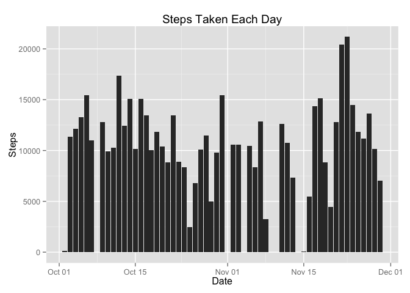
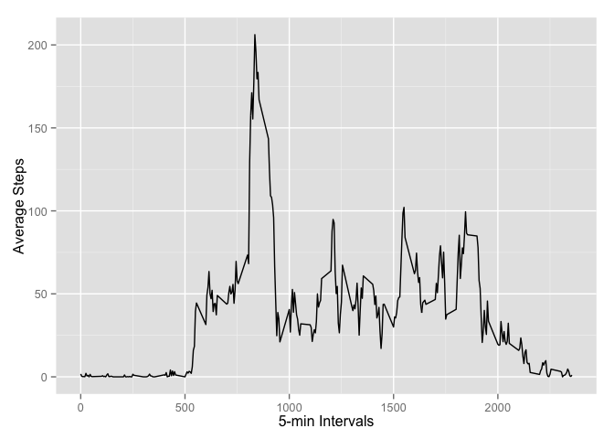
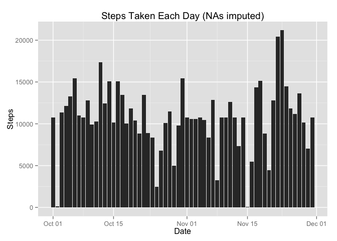
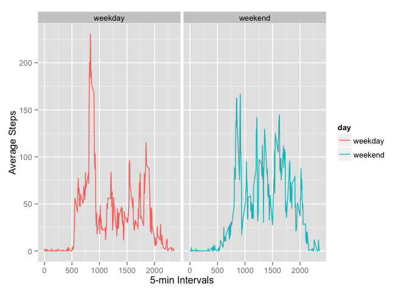

# Activity Mornitoring Data Analysis
Zeyu Chen  
November 8, 2014  

This R markdown document is used to process and analyze the actibity mornitoring data.
opts_chunk$set(echo=TRUE)
###Loading and preprocessing the data.

```r
act<-read.csv('activity.csv')
#Clean up the data by convert fators to dates
act$date<-as.Date(act$date)
```

###What is mean total number of steps taken per day?

```r
#Make a histogram of the total number of steps taken each day
library(ggplot2)
qplot(x=date,y=steps,data=subset(act,complete.cases(act)),stat='summary',fun.y=sum, geom="bar")+xlab("Date")+ylab("Steps")+ggtitle("Steps Taken Each Day")
```

 

```r
#Calculate and report the mean and median total number of steps taken per day
x<-subset(act,complete.cases(act))
steps_per_day<-tapply(x$steps,x$date,sum)
mean<-mean(steps_per_day)
median<-median(steps_per_day)
```
The mean of total steps per day is 10766 and the median is 10765.

###What is the average daily activity pattern?

```r
#Make a time series plot (i.e. type = "l") of the 5-minute interval (x-axis) and the average number of steps taken, averaged across all days (y-axis)
interval_steps<-tapply(act$steps,act$interval,mean,na.rm=TRUE)
plot_data<-data.frame(as.numeric(names(interval_steps)),interval_steps)
colnames(plot_data)<-c('intervals','steps')
qplot(intervals,steps,data=plot_data,geom='line')+labs(x='5-min Intervals',y='Average Steps')
```

 

```r
index <- which.max(interval_steps)
interval <- names(index)
maxSteps <- interval_steps[104]
```
Interval 835 on average contains the maximum number of steps, which is 206.1698113.

###Imputing missing values

```r
#Calculate and report the total number of missing values in the dataset
NAs<-sum(is.na(act))
```

The total number of missing values in the data set is 2304.


```r
#Use the avearge from the 5-min interval to impute missing values
for (i in 1:nrow(act)){
    if(is.na(act[i,1])){
        act[i,1]<-interval_steps[as.character((act[i,3]))]
    }
}
#Prview the imputed data
head(act)
```

```
##       steps       date interval
## 1 1.7169811 2012-10-01        0
## 2 0.3396226 2012-10-01        5
## 3 0.1320755 2012-10-01       10
## 4 0.1509434 2012-10-01       15
## 5 0.0754717 2012-10-01       20
## 6 2.0943396 2012-10-01       25
```

```r
#Plot the data again
qplot(x=date,y=steps,data=act,stat='summary',fun.y=sum, geom="bar")+xlab("Date")+ylab("Steps")+ggtitle("Steps Taken Each Day (NAs imputed)")
```

 

```r
#Calculate and report the mean and median total number of steps taken per day
steps_per_day_1<-tapply(act$steps,act$date,sum)
mean1<-mean(steps_per_day_1)
median1<-median(steps_per_day_1)
```

Both mean and median are 10766 after imputing the NAs. So there is not a significant difference compares to mean and median by ommiting NAs, which were 10766 and 10765.  

###Are there differences in activity patterns between weekdays and weekends?

```r
library(dplyr)
```

```
## 
## Attaching package: 'dplyr'
## 
## The following object is masked from 'package:stats':
## 
##     filter
## 
## The following objects are masked from 'package:base':
## 
##     intersect, setdiff, setequal, union
```

```r
act$day<-factor(weekdays(act$date))
levels(act$day)<-list(weekday = c("Monday", "Tuesday", "Wednesday", "Thursday",    "Friday"), weekend=c("Saturday", "Sunday"))
by_day_interval<-group_by(act,day,interval)
result<-summarize(by_day_interval,mean(steps))
names(result)[3]<-'steps'
qplot(interval,steps,data=result,facets=.~day,geom='line',color=day)+labs(y='Average Steps', x='5-min Intervals')
```

 
